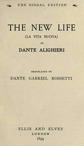

# The New Life (La Vita Nuova) <kbd>v2.3.0</kbd>

## Authors

 - Dante Alighieri <small>(1265 - 1321)</small>

## Translators

 - Rossetti, Dante Gabriel <small>(1828 - 1882)</small>

## Subjects

 - Italian literature

## Readablility

 - **A1:** 78%
 - **A2:** 84%
 - **B1:** 89%
 - **B2:** 95%
 - **C1:** 98%
 - **C2:** 100%

## Words Count

 - **A1:** 473
 - **A2:** 339
 - **B1:** 485
 - **B2:** 595
 - **C1:** 497
 - **C2:** 256

## Source

<kbd>GUTHENBURGE:41085</kbd>
