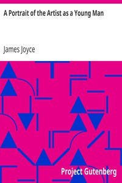

# A Portrait of the Artist as a Young Man <kbd>v2.2.1</kbd>

## Authors

 - Joyce, James <small>(1882 - 1941)</small>

## Translators

## Subjects

 - Artists
 - Autobiographical fiction
 - Bildungsromans
 - Dublin (Ireland)
 - Young men

## Readablility

 - **A1:** 76%
 - **A2:** 81%
 - **B1:** 87%
 - **B2:** 93%
 - **C1:** 97%
 - **C2:** 100%

## Words Count

 - **A1:** 493
 - **A2:** 474
 - **B1:** 836
 - **B2:** 1303
 - **C1:** 1598
 - **C2:** 1270

## Source

<kbd>GUTHENBURGE:4217</kbd>
