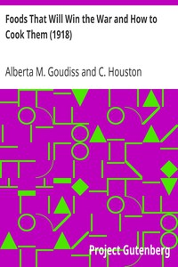

# Foods That Will Win the War and How to Cook Them (1918) <kbd>v2.3.0</kbd>

## Authors

 - Goudiss, Alberta M. (Alberta Moorhouse) <small>(1876 - -1)</small>
 - Goudiss, C. Houston (Charles Houston) <small>(1880 - -1)</small>

## Translators

## Subjects

 - Cooking, American
 - Food conservation
 - Menus

## Readablility

 - **A1:** 55%
 - **A2:** 60%
 - **B1:** 73%
 - **B2:** 81%
 - **C1:** 92%
 - **C2:** 99%

## Words Count

 - **A1:** 385
 - **A2:** 248
 - **B1:** 387
 - **B2:** 490
 - **C1:** 466
 - **C2:** 390

## Source

<kbd>GUTHENBURGE:15464</kbd>
