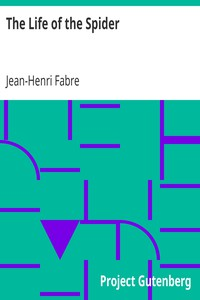

# The Life of the Spider <kbd>v2.2.1</kbd>

## Authors

 - Fabre, Jean-Henri <small>(1823 - 1915)</small>

## Translators

 - Teixeira de Mattos, Alexander <small>(1865 - 1921)</small>

## Subjects

 - Spiders

## Readablility

 - **A1:** 70%
 - **A2:** 76%
 - **B1:** 82%
 - **B2:** 89%
 - **C1:** 95%
 - **C2:** 100%

## Words Count

 - **A1:** 472
 - **A2:** 436
 - **B1:** 767
 - **B2:** 1209
 - **C1:** 1499
 - **C2:** 1287

## Source

<kbd>GUTHENBURGE:1887</kbd>
