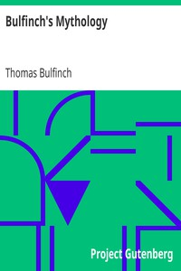

# Bulfinch's Mythology <kbd>v2.3.0</kbd>

## Authors

 - Bulfinch, Thomas <small>(1796 - 1867)</small>

## Translators

## Subjects

 - Charlemagne, Emperor, 742-814
 - Folklore
 - Mythology
 - Romances

## Readablility

 - **A1:** 75%
 - **A2:** 81%
 - **B1:** 87%
 - **B2:** 93%
 - **C1:** 98%
 - **C2:** 100%

## Words Count

 - **A1:** 494
 - **A2:** 492
 - **B1:** 972
 - **B2:** 1835
 - **C1:** 2874
 - **C2:** 2428

## Source

<kbd>GUTHENBURGE:4928</kbd>
