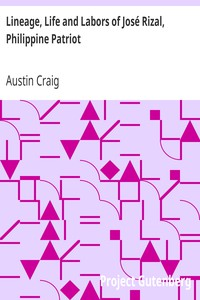

# Lineage, Life and Labors of José Rizal, Philippine Patriot <kbd>v2.2.1</kbd>

## Authors

 - Craig, Austin <small>(1872 - 1949)</small>

## Translators

## Subjects

 - Rizal, José, 1861-1896

## Readablility

 - **A1:** 73%
 - **A2:** 79%
 - **B1:** 86%
 - **B2:** 92%
 - **C1:** 97%
 - **C2:** 100%

## Words Count

 - **A1:** 490
 - **A2:** 464
 - **B1:** 827
 - **B2:** 1324
 - **C1:** 1538
 - **C2:** 924

## Source

<kbd>GUTHENBURGE:6867</kbd>
