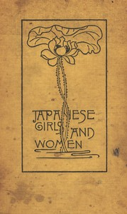

# Japanese Girls and Women: Revised and Enlarged Edition <kbd>GUTHENBURGE</kbd>

## Authors

 - Bacon, Alice Mabel <small>(1858 - 1918)</small>

## Translators

## Subjects

 - Japan
 - Women
 - Women

## Readablility

 - **A1:** 43%
 - **A2:** 58%
 - **B1:** 72%
 - **B2:** 86%
 - **C1:** 96%
 - **C2:** 100%

## Words Count

 - **A1:** 400
 - **A2:** 471
 - **B1:** 895
 - **B2:** 1446
 - **C1:** 1760
 - **C2:** 1158
