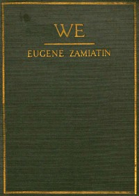

# We <kbd>v2.0.2</kbd>

## Authors

 - Zamiatin, Evgenii Ivanovich <small>(1884 - 1937)</small>

## Translators

 - Zilboorg, Gregory <small>(1890 - 1959)</small>

## Subjects

 - Dystopias
 - Russian fiction
 - Science fiction
 - Totalitarianism

## Readablility

 - **A1:** 54%
 - **A2:** 61%
 - **B1:** 73%
 - **B2:** 87%
 - **C1:** 91%
 - **C2:** 100%

## Words Count

 - **A1:** 533
 - **A2:** 479
 - **B1:** 753
 - **B2:** 1226
 - **C1:** 496
 - **C2:** 2509

## Source

<kbd>GUTHENBURGE:61963</kbd>
