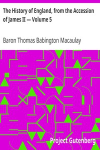

# The History of England, from the Accession of James II — Volume 5 <kbd>v2.2.1</kbd>

## Authors

 - Macaulay, Thomas Babington Macaulay, Baron <small>(1800 - 1859)</small>

## Translators

## Subjects

 - Great Britain
 - Great Britain

## Readablility

 - **A1:** 75%
 - **A2:** 80%
 - **B1:** 86%
 - **B2:** 93%
 - **C1:** 97%
 - **C2:** 100%

## Words Count

 - **A1:** 491
 - **A2:** 473
 - **B1:** 885
 - **B2:** 1477
 - **C1:** 1831
 - **C2:** 1329

## Source

<kbd>GUTHENBURGE:2614</kbd>
