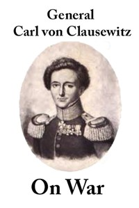

# On War <kbd>v2.3.0</kbd>

## Authors

 - Clausewitz, Carl von <small>(1780 - 1831)</small>

## Translators

 - Graham, J. J. (James John) <small>(-1 - -1)</small>

## Subjects

 - Military art and science
 - War

## Readablility

 - **A1:** 73%
 - **A2:** 81%
 - **B1:** 88%
 - **B2:** 94%
 - **C1:** 98%
 - **C2:** 100%

## Words Count

 - **A1:** 486
 - **A2:** 453
 - **B1:** 819
 - **B2:** 1396
 - **C1:** 1848
 - **C2:** 1447

## Source

<kbd>GUTHENBURGE:1946</kbd>
