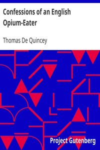

# Confessions of an English Opium-Eater <kbd>v2.3.0</kbd>

## Authors

 - De Quincey, Thomas <small>(1785 - 1859)</small>

## Translators

## Subjects

 - Authors, English
 - De Quincey, Thomas, 1785-1859
 - Drug addicts
 - Opium abuse

## Readablility

 - **A1:** 74%
 - **A2:** 80%
 - **B1:** 87%
 - **B2:** 93%
 - **C1:** 98%
 - **C2:** 100%

## Words Count

 - **A1:** 491
 - **A2:** 444
 - **B1:** 750
 - **B2:** 1081
 - **C1:** 1202
 - **C2:** 625

## Source

<kbd>GUTHENBURGE:2040</kbd>
