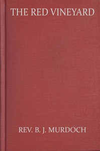

# The Red Vineyard <kbd>v2.2.1</kbd>

## Authors

 - Murdoch, B. J. (Benedict Joseph) <small>(1886 - 1973)</small>

## Translators

## Subjects

 - Murdoch, B. J. (Benedict Joseph), 1886-1973
 - World War, 1914-1918
 - World War, 1914-1918

## Readablility

 - **A1:** 76%
 - **A2:** 83%
 - **B1:** 89%
 - **B2:** 94%
 - **C1:** 98%
 - **C2:** 100%

## Words Count

 - **A1:** 492
 - **A2:** 462
 - **B1:** 820
 - **B2:** 1112
 - **C1:** 1174
 - **C2:** 747

## Source

<kbd>GUTHENBURGE:68063</kbd>
