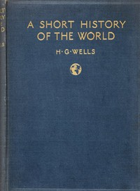

# A Short History of the World <kbd>v2.2.1</kbd>

## Authors

 - Wells, H. G. (Herbert George) <small>(1866 - 1946)</small>

## Translators

## Subjects

 - World history

## Readablility

 - **A1:** 73%
 - **A2:** 78%
 - **B1:** 85%
 - **B2:** 91%
 - **C1:** 97%
 - **C2:** 100%

## Words Count

 - **A1:** 488
 - **A2:** 467
 - **B1:** 860
 - **B2:** 1428
 - **C1:** 1806
 - **C2:** 1504

## Source

<kbd>GUTHENBURGE:35461</kbd>
