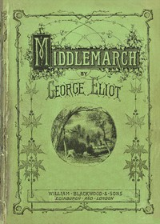

# Middlemarch <kbd>v2.0.2</kbd>

## Authors

 - Eliot, George <small>(1819 - 1880)</small>

## Translators

## Subjects

 - Bildungsromans
 - City and town life
 - Didactic fiction
 - Domestic fiction
 - England
 - Love stories
 - Married people
 - Young women

## Readablility

 - **A1:** 53%
 - **A2:** 60%
 - **B1:** 70%
 - **B2:** 83%
 - **C1:** 87%
 - **C2:** 100%

## Words Count

 - **A1:** 657
 - **A2:** 707
 - **B1:** 1295
 - **B2:** 2313
 - **C1:** 1030
 - **C2:** 9913

## Source

<kbd>GUTHENBURGE:145</kbd>
