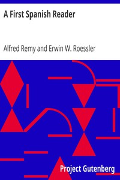

# A First Spanish Reader <kbd>v2.3.0</kbd>

## Authors

 - Remy, Alfred <small>(1870 - -1)</small>
 - Roessler, Erwin W. (Erwin William) <small>(1880 - -1)</small>

## Translators

## Subjects

 - Spanish language
 - Spanish language

## Readablility

 - **A1:** 75%
 - **A2:** 80%
 - **B1:** 84%
 - **B2:** 87%
 - **C1:** 93%
 - **C2:** 99%

## Words Count

 - **A1:** 431
 - **A2:** 351
 - **B1:** 547
 - **B2:** 664
 - **C1:** 650
 - **C2:** 499

## Source

<kbd>GUTHENBURGE:15353</kbd>
