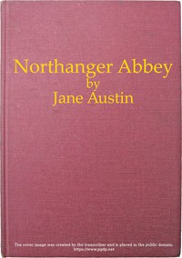

# Northanger Abbey <kbd>v2.2.1</kbd>

## Authors

 - Austen, Jane <small>(1775 - 1817)</small>

## Translators

## Subjects

 - Books and reading
 - England
 - England
 - Gentry
 - Gothic fiction
 - Horror tales
 - Love stories
 - Marriage
 - Satire
 - Young women

## Readablility

 - **A1:** 78%
 - **A2:** 84%
 - **B1:** 90%
 - **B2:** 95%
 - **C1:** 99%
 - **C2:** 100%

## Words Count

 - **A1:** 487
 - **A2:** 459
 - **B1:** 821
 - **B2:** 1232
 - **C1:** 1294
 - **C2:** 627

## Source

<kbd>GUTHENBURGE:121</kbd>
