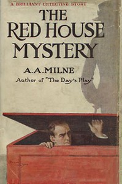

# The Red House Mystery <kbd>v2.2.1</kbd>

## Authors

 - Milne, A. A. (Alan Alexander) <small>(1882 - 1956)</small>

## Translators

## Subjects

 - Detective and mystery stories
 - England

## Readablility

 - **A1:** 79%
 - **A2:** 85%
 - **B1:** 92%
 - **B2:** 96%
 - **C1:** 99%
 - **C2:** 100%

## Words Count

 - **A1:** 485
 - **A2:** 426
 - **B1:** 645
 - **B2:** 868
 - **C1:** 782
 - **C2:** 331

## Source

<kbd>GUTHENBURGE:1872</kbd>
