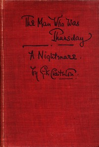

# The Man Who Was Thursday: A Nightmare <kbd>v2.0.2</kbd>

## Authors

 - Chesterton, G. K. (Gilbert Keith) <small>(1874 - 1936)</small>

## Translators

## Subjects

 - Allegories
 - Anarchists
 - Detective and mystery stories
 - Fantasy fiction
 - London (England)
 - Police

## Readablility

 - **A1:** 52%
 - **A2:** 59%
 - **B1:** 70%
 - **B2:** 85%
 - **C1:** 89%
 - **C2:** 100%

## Words Count

 - **A1:** 546
 - **A2:** 480
 - **B1:** 837
 - **B2:** 1235
 - **C1:** 543
 - **C2:** 3096

## Source

<kbd>GUTHENBURGE:1695</kbd>
