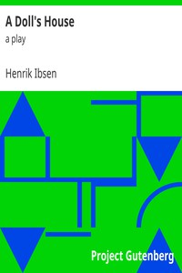

# A Doll's House : a play <kbd>v2.0.7</kbd>

## Authors

 - Ibsen, Henrik <small>(1828 - 1906)</small>

## Translators

## Subjects

 - Man-woman relationships
 - Marriage
 - Norwegian drama
 - Wives

## Readablility

 - **A1:** 72%
 - **A2:** 78%
 - **B1:** 82%
 - **B2:** 86%
 - **C1:** 87%
 - **C2:** 100%

## Words Count

 - **A1:** 661
 - **A2:** 369
 - **B1:** 466
 - **B2:** 457
 - **C1:** 128
 - **C2:** 790

## Source

<kbd>GUTHENBURGE:2542</kbd>
