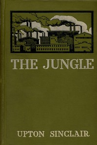

# The Jungle <kbd>v2.0.9</kbd>

## Authors

 - Sinclair, Upton <small>(1878 - 1968)</small>

## Translators

## Subjects

 - Chicago (Ill.)
 - Immigrants
 - Lithuanian Americans
 - Meat industry and trade
 - Political fiction
 - Stockyards
 - Working class

## Readablility

 - **A1:** 73%
 - **A2:** 79%
 - **B1:** 84%
 - **B2:** 89%
 - **C1:** 90%
 - **C2:** 100%

## Words Count

 - **A1:** 884
 - **A2:** 755
 - **B1:** 1188
 - **B2:** 1606
 - **C1:** 639
 - **C2:** 5304

## Source

<kbd>GUTHENBURGE:140</kbd>
