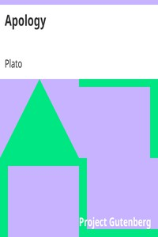

# Apology <kbd>v2.3.0</kbd>

## Authors

 - Plato <small>(-428 - -348)</small>

## Translators

 - Jowett, Benjamin <small>(1817 - 1893)</small>

## Subjects

 - Classical literature
 - Philosophy, Ancient
 - Socrates, 470 BC-399 BC

## Readablility

 - **A1:** 79%
 - **A2:** 85%
 - **B1:** 90%
 - **B2:** 95%
 - **C1:** 99%
 - **C2:** 100%

## Words Count

 - **A1:** 423
 - **A2:** 295
 - **B1:** 406
 - **B2:** 504
 - **C1:** 373
 - **C2:** 161

## Source

<kbd>GUTHENBURGE:1656</kbd>
