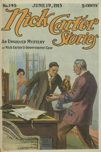

# Nick Carter Stories No. 145, June 19, 1915: An Unsolved Mystery; Or, Nick Carter's Goverment Case <kbd>v2.3.0</kbd>

## Authors

 - Carter, Nicholas (House name) <small>(-1 - -1)</small>
 - Waddell, C. C. (Charles Carey) <small>(1868 - 1930)</small>

## Translators

## Subjects

 - Detective and mystery stories, American
 - Popular literature

## Readablility

 - **A1:** 73%
 - **A2:** 79%
 - **B1:** 85%
 - **B2:** 91%
 - **C1:** 97%
 - **C2:** 100%

## Words Count

 - **A1:** 481
 - **A2:** 437
 - **B1:** 732
 - **B2:** 1005
 - **C1:** 1008
 - **C2:** 555

## Source

<kbd>GUTHENBURGE:68022</kbd>
