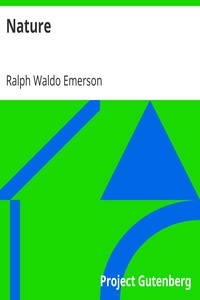

# Nature <kbd>v2.0.2</kbd>

## Authors

 - Emerson, Ralph Waldo <small>(1803 - 1882)</small>

## Translators

## Subjects

 - Nature
 - Philosophy, American

## Readablility

 - **A1:** 50%
 - **A2:** 58%
 - **B1:** 70%
 - **B2:** 85%
 - **C1:** 89%
 - **C2:** 100%

## Words Count

 - **A1:** 431
 - **A2:** 361
 - **B1:** 522
 - **B2:** 772
 - **C1:** 300
 - **C2:** 1352

## Source

<kbd>GUTHENBURGE:29433</kbd>
