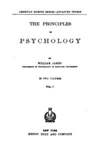

# The Principles of Psychology, Volume 1 (of 2) <kbd>v2.3.0</kbd>

## Authors

 - James, William <small>(1842 - 1910)</small>

## Translators

## Subjects

 - Psychology

## Readablility

 - **A1:** 73%
 - **A2:** 79%
 - **B1:** 86%
 - **B2:** 92%
 - **C1:** 97%
 - **C2:** 100%

## Words Count

 - **A1:** 494
 - **A2:** 486
 - **B1:** 919
 - **B2:** 1570
 - **C1:** 2290
 - **C2:** 2168

## Source

<kbd>GUTHENBURGE:57628</kbd>
