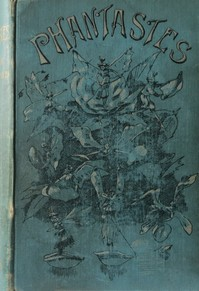

# Phantastes: A Faerie Romance for Men and Women <kbd>v2.2.1</kbd>

## Authors

 - MacDonald, George <small>(1824 - 1905)</small>

## Translators

## Subjects

 - Fantasy fiction

## Readablility

 - **A1:** 76%
 - **A2:** 82%
 - **B1:** 88%
 - **B2:** 94%
 - **C1:** 98%
 - **C2:** 100%

## Words Count

 - **A1:** 490
 - **A2:** 452
 - **B1:** 815
 - **B2:** 1246
 - **C1:** 1360
 - **C2:** 741

## Source

<kbd>GUTHENBURGE:325</kbd>
