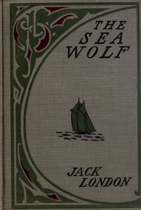

# The Sea-Wolf <kbd>v2.2.1</kbd>

## Authors

 - London, Jack <small>(1876 - 1916)</small>

## Translators

## Subjects

 - Arctic regions
 - Sea stories
 - Sealers (Persons)
 - Sealing ships
 - Ship captains

## Readablility

 - **A1:** 75%
 - **A2:** 81%
 - **B1:** 87%
 - **B2:** 92%
 - **C1:** 97%
 - **C2:** 100%

## Words Count

 - **A1:** 486
 - **A2:** 466
 - **B1:** 850
 - **B2:** 1398
 - **C1:** 1705
 - **C2:** 1350

## Source

<kbd>GUTHENBURGE:1074</kbd>
