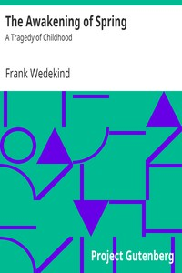

# The Awakening of Spring: A Tragedy of Childhood <kbd>v2.2.1</kbd>

## Authors

 - Wedekind, Frank <small>(1864 - 1918)</small>

## Translators

 - Ziegler, Francis J. (Francis Joseph) <small>(1866 - -1)</small>

## Subjects

 - German drama

## Readablility

 - **A1:** 76%
 - **A2:** 82%
 - **B1:** 88%
 - **B2:** 93%
 - **C1:** 98%
 - **C2:** 100%

## Words Count

 - **A1:** 474
 - **A2:** 402
 - **B1:** 615
 - **B2:** 765
 - **C1:** 761
 - **C2:** 440

## Source

<kbd>GUTHENBURGE:35242</kbd>
