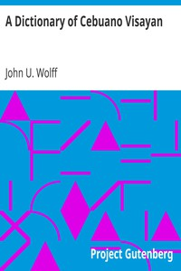

# A Dictionary of Cebuano Visayan <kbd>v2.3.0</kbd>

## Authors

 - Wolff, John U. <small>(-1 - -1)</small>

## Translators

## Subjects

 - Cebuano language

## Readablility

 - **A1:** 75%
 - **A2:** 79%
 - **B1:** 83%
 - **B2:** 88%
 - **C1:** 93%
 - **C2:** 99%

## Words Count

 - **A1:** 492
 - **A2:** 496
 - **B1:** 974
 - **B2:** 1845
 - **C1:** 3133
 - **C2:** 4198

## Source

<kbd>GUTHENBURGE:40074</kbd>
