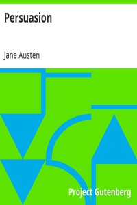

# Persuasion <kbd>GUTHENBURGE</kbd>

## Authors

 - Austen, Jane <small>(1775 - 1817)</small>

## Translators

## Subjects

 - Dysfunctional families
 - England
 - First loves
 - Love stories
 - Motherless families
 - Psychological fiction
 - Regency fiction
 - Rejection (Psychology)
 - Ship captains
 - Young women

## Readablility

 - **A1:** 53%
 - **A2:** 67%
 - **B1:** 80%
 - **B2:** 91%
 - **C1:** 98%
 - **C2:** 100%

## Words Count

 - **A1:** 400
 - **A2:** 450
 - **B1:** 791
 - **B2:** 1148
 - **C1:** 1175
 - **C2:** 600
