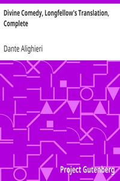

# Divine Comedy, Longfellow's Translation, Complete <kbd>v2.3.0</kbd>

## Authors

 - Dante Alighieri <small>(1265 - 1321)</small>

## Translators

 - Longfellow, Henry Wadsworth <small>(1807 - 1882)</small>

## Subjects

 - Epic poetry, Italian
 - Italian poetry

## Readablility

 - **A1:** 77%
 - **A2:** 82%
 - **B1:** 88%
 - **B2:** 93%
 - **C1:** 97%
 - **C2:** 100%

## Words Count

 - **A1:** 487
 - **A2:** 442
 - **B1:** 777
 - **B2:** 1230
 - **C1:** 1531
 - **C2:** 1358

## Source

<kbd>GUTHENBURGE:1004</kbd>
