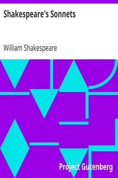

# Shakespeare's Sonnets <kbd>v2.2.1</kbd>

## Authors

 - Shakespeare, William <small>(1564 - 1616)</small>

## Translators

## Subjects

 - English poetry
 - Sonnets, English

## Readablility

 - **A1:** 73%
 - **A2:** 80%
 - **B1:** 87%
 - **B2:** 93%
 - **C1:** 98%
 - **C2:** 100%

## Words Count

 - **A1:** 445
 - **A2:** 300
 - **B1:** 470
 - **B2:** 611
 - **C1:** 580
 - **C2:** 312

## Source

<kbd>GUTHENBURGE:1041</kbd>
