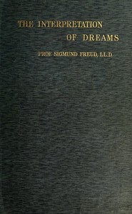

# The Interpretation of Dreams <kbd>v2.3.0</kbd>

## Authors

 - Freud, Sigmund <small>(1856 - 1939)</small>

## Translators

 - Brill, A. A. (Abraham Arden) <small>(1874 - 1948)</small>

## Subjects

 - Dream interpretation
 - Psychoanalysis

## Readablility

 - **A1:** 72%
 - **A2:** 77%
 - **B1:** 86%
 - **B2:** 92%
 - **C1:** 97%
 - **C2:** 100%

## Words Count

 - **A1:** 491
 - **A2:** 487
 - **B1:** 921
 - **B2:** 1534
 - **C1:** 2076
 - **C2:** 1716

## Source

<kbd>GUTHENBURGE:66048</kbd>
