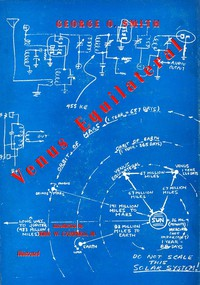

# Venus Equilateral <kbd>v2.0.2</kbd>

## Authors

 - Smith, George O. (George Oliver) <small>(1911 - 1981)</small>

## Translators

## Subjects

 - Inventions
 - Science fiction
 - Space stations
 - Technology

## Readablility

 - **A1:** 49%
 - **A2:** 57%
 - **B1:** 68%
 - **B2:** 81%
 - **C1:** 85%
 - **C2:** 100%

## Words Count

 - **A1:** 618
 - **A2:** 636
 - **B1:** 1093
 - **B2:** 1786
 - **C1:** 771
 - **C2:** 5134

## Source

<kbd>GUTHENBURGE:68008</kbd>
