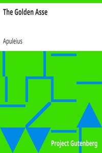

# The Golden Asse <kbd>v2.3.0</kbd>

## Authors

 - Apuleius <small>(-1 - -1)</small>

## Translators

 - Adlington, William, active 1566 <small>(-1 - -1)</small>

## Subjects

 - Classical literature
 - Metamorphosis

## Readablility

 - **A1:** 80%
 - **A2:** 84%
 - **B1:** 90%
 - **B2:** 95%
 - **C1:** 98%
 - **C2:** 100%

## Words Count

 - **A1:** 469
 - **A2:** 387
 - **B1:** 652
 - **B2:** 866
 - **C1:** 956
 - **C2:** 560

## Source

<kbd>GUTHENBURGE:1666</kbd>
