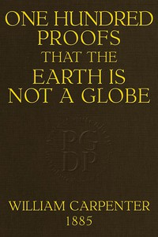

# One Hundred Proofs That the Earth Is Not a Globe <kbd>v2.3.0</kbd>

## Authors

 - Carpenter, William <small>(1830 - 1896)</small>

## Translators

## Subjects

 - Earth (Planet)

## Readablility

 - **A1:** 75%
 - **A2:** 81%
 - **B1:** 88%
 - **B2:** 93%
 - **C1:** 98%
 - **C2:** 100%

## Words Count

 - **A1:** 441
 - **A2:** 315
 - **B1:** 481
 - **B2:** 558
 - **C1:** 490
 - **C2:** 291

## Source

<kbd>GUTHENBURGE:55387</kbd>
