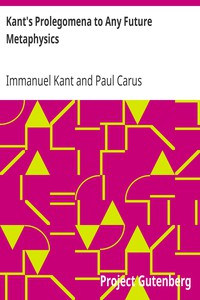

# Kant's Prolegomena to Any Future Metaphysics <kbd>v2.2.1</kbd>

## Authors

 - Kant, Immanuel <small>(1724 - 1804)</small>

## Translators

## Subjects

 - Knowledge, Theory of
 - Metaphysics

## Readablility

 - **A1:** 73%
 - **A2:** 79%
 - **B1:** 86%
 - **B2:** 92%
 - **C1:** 97%
 - **C2:** 100%

## Words Count

 - **A1:** 431
 - **A2:** 316
 - **B1:** 509
 - **B2:** 728
 - **C1:** 736
 - **C2:** 450

## Source

<kbd>GUTHENBURGE:52821</kbd>
