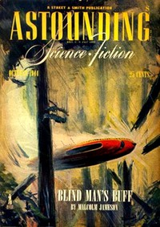

# Beam Pirate <kbd>v2.2.1</kbd>

## Authors

 - Smith, George O. (George Oliver) <small>(1911 - 1981)</small>

## Translators

## Subjects

 - Inventions
 - Science fiction
 - Space stations
 - Stocks

## Readablility

 - **A1:** 74%
 - **A2:** 80%
 - **B1:** 86%
 - **B2:** 92%
 - **C1:** 97%
 - **C2:** 100%

## Words Count

 - **A1:** 431
 - **A2:** 302
 - **B1:** 395
 - **B2:** 470
 - **C1:** 422
 - **C2:** 252

## Source

<kbd>GUTHENBURGE:67998</kbd>
