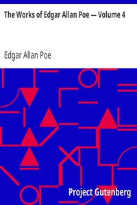

# The Works of Edgar Allan Poe — Volume 4 <kbd>v2.2.1</kbd>

## Authors

 - Poe, Edgar Allan <small>(1809 - 1849)</small>

## Translators

## Subjects

 - American fiction
 - Fantasy fiction
 - Horror tales, American
 - Short stories

## Readablility

 - **A1:** 73%
 - **A2:** 79%
 - **B1:** 86%
 - **B2:** 92%
 - **C1:** 97%
 - **C2:** 100%

## Words Count

 - **A1:** 495
 - **A2:** 482
 - **B1:** 896
 - **B2:** 1533
 - **C1:** 1993
 - **C2:** 1482

## Source

<kbd>GUTHENBURGE:2150</kbd>
