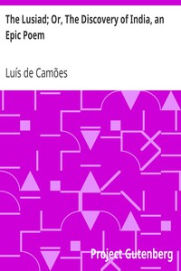

# The Lusiad; Or, The Discovery of India, an Epic Poem <kbd>v2.2.1</kbd>

## Authors

 - Camões, Luís de <small>(-1 - 1580)</small>

## Translators

 - Mickle, William Julius <small>(1735 - 1788)</small>

## Subjects

 - Epic poetry, Portuguese
 - Explorers
 - Gama, Vasco da, 1469-1524
 - India
 - Portugal
 - Portuguese poetry

## Readablility

 - **A1:** 71%
 - **A2:** 76%
 - **B1:** 83%
 - **B2:** 90%
 - **C1:** 97%
 - **C2:** 100%

## Words Count

 - **A1:** 492
 - **A2:** 480
 - **B1:** 903
 - **B2:** 1594
 - **C1:** 2238
 - **C2:** 1837

## Source

<kbd>GUTHENBURGE:32528</kbd>
