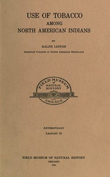

# Use of tobacco among North American Indians <kbd>v2.3.0</kbd>

## Authors

 - Linton, Ralph <small>(1893 - 1953)</small>

## Translators

## Subjects

 - Indians of North America
 - Tobacco pipes

## Readablility

 - **A1:** 67%
 - **A2:** 74%
 - **B1:** 81%
 - **B2:** 91%
 - **C1:** 97%
 - **C2:** 100%

## Words Count

 - **A1:** 360
 - **A2:** 207
 - **B1:** 316
 - **B2:** 409
 - **C1:** 312
 - **C2:** 159

## Source

<kbd>GUTHENBURGE:68145</kbd>
