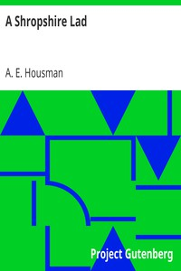

# A Shropshire Lad <kbd>v2.3.0</kbd>

## Authors

 - Housman, A. E. (Alfred Edward) <small>(1859 - 1936)</small>

## Translators

## Subjects

 - Shropshire (England)

## Readablility

 - **A1:** 72%
 - **A2:** 80%
 - **B1:** 87%
 - **B2:** 93%
 - **C1:** 98%
 - **C2:** 100%

## Words Count

 - **A1:** 419
 - **A2:** 276
 - **B1:** 368
 - **B2:** 441
 - **C1:** 383
 - **C2:** 190

## Source

<kbd>GUTHENBURGE:5720</kbd>
