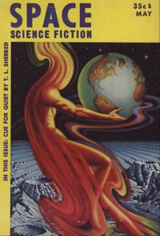

# Second Variety <kbd>v2.3.0</kbd>

## Authors

 - Dick, Philip K. <small>(1928 - 1982)</small>

## Translators

## Subjects

 - Robots
 - Science fiction
 - War stories

## Readablility

 - **A1:** 74%
 - **A2:** 81%
 - **B1:** 88%
 - **B2:** 93%
 - **C1:** 98%
 - **C2:** 100%

## Words Count

 - **A1:** 423
 - **A2:** 292
 - **B1:** 374
 - **B2:** 455
 - **C1:** 367
 - **C2:** 200

## Source

<kbd>GUTHENBURGE:32032</kbd>
