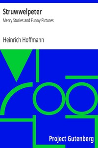

# Struwwelpeter: Merry Stories and Funny Pictures <kbd>v2.2.1</kbd>

## Authors

 - Hoffmann, Heinrich <small>(1809 - 1894)</small>

## Translators

## Subjects

 - Behavior
 - Children
 - Children's poetry, German
 - Children's stories, German
 - Picture books for children
 - Stories in rhyme

## Readablility

 - **A1:** 70%
 - **A2:** 77%
 - **B1:** 85%
 - **B2:** 93%
 - **C1:** 99%
 - **C2:** 100%

## Words Count

 - **A1:** 328
 - **A2:** 167
 - **B1:** 199
 - **B2:** 239
 - **C1:** 165
 - **C2:** 50

## Source

<kbd>GUTHENBURGE:12116</kbd>
