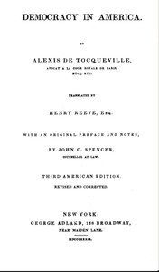

# Democracy in America — Volume 1 <kbd>v2.2.1</kbd>

## Authors

 - Tocqueville, Alexis de <small>(1805 - 1859)</small>

## Translators

 - Reeve, Henry <small>(1813 - 1895)</small>

## Subjects

 - Democracy
 - United States
 - United States

## Readablility

 - **A1:** 71%
 - **A2:** 78%
 - **B1:** 85%
 - **B2:** 92%
 - **C1:** 98%
 - **C2:** 100%

## Words Count

 - **A1:** 488
 - **A2:** 455
 - **B1:** 868
 - **B2:** 1415
 - **C1:** 1899
 - **C2:** 1421

## Source

<kbd>GUTHENBURGE:815</kbd>
