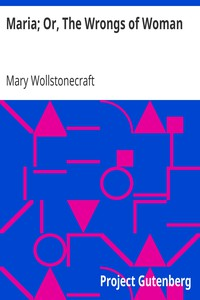

# Maria; Or, The Wrongs of Woman <kbd>v2.3.0</kbd>

## Authors

 - Wollstonecraft, Mary <small>(1759 - 1797)</small>

## Translators

## Subjects

 - Autobiographical fiction
 - Feminist fiction
 - Women

## Readablility

 - **A1:** 73%
 - **A2:** 79%
 - **B1:** 86%
 - **B2:** 92%
 - **C1:** 98%
 - **C2:** 100%

## Words Count

 - **A1:** 485
 - **A2:** 438
 - **B1:** 761
 - **B2:** 1175
 - **C1:** 1257
 - **C2:** 744

## Source

<kbd>GUTHENBURGE:134</kbd>
