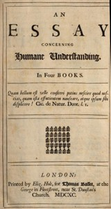

# An Essay Concerning Humane Understanding, Volume 1: MDCXC, Based on the 2nd Edition, Books 1 and 2 <kbd>v2.0.2</kbd>

## Authors

 - Locke, John <small>(1632 - 1704)</small>

## Translators

## Subjects

 - Knowledge, Theory of

## Readablility

 - **A1:** 54%
 - **A2:** 62%
 - **B1:** 75%
 - **B2:** 89%
 - **C1:** 92%
 - **C2:** 100%

## Words Count

 - **A1:** 547
 - **A2:** 489
 - **B1:** 816
 - **B2:** 1250
 - **C1:** 420
 - **C2:** 3059

## Source

<kbd>GUTHENBURGE:10615</kbd>
