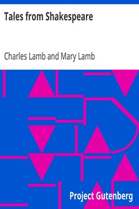

# Tales from Shakespeare <kbd>v2.3.0</kbd>

## Authors

 - Lamb, Charles <small>(1775 - 1834)</small>
 - Lamb, Mary <small>(1764 - 1847)</small>

## Translators

## Subjects

 - Shakespeare, William, 1564-1616
 - Shakespeare, William, 1564-1616

## Readablility

 - **A1:** 78%
 - **A2:** 83%
 - **B1:** 89%
 - **B2:** 94%
 - **C1:** 98%
 - **C2:** 100%

## Words Count

 - **A1:** 490
 - **A2:** 475
 - **B1:** 832
 - **B2:** 1301
 - **C1:** 1477
 - **C2:** 843

## Source

<kbd>GUTHENBURGE:573</kbd>
