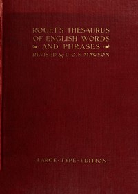

# Roget's Thesaurus <kbd>v2.2.1</kbd>

## Authors

 - Roget, Peter Mark <small>(1779 - 1869)</small>

## Translators

## Subjects

 - English language

## Readablility

 - **A1:** 59%
 - **A2:** 65%
 - **B1:** 71%
 - **B2:** 79%
 - **C1:** 87%
 - **C2:** 98%

## Words Count

 - **A1:** 479
 - **A2:** 476
 - **B1:** 921
 - **B2:** 1723
 - **C1:** 3227
 - **C2:** 6448

## Source

<kbd>GUTHENBURGE:22</kbd>
