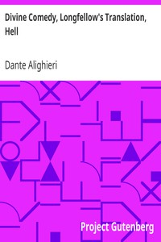

# Divine Comedy, Longfellow's Translation, Hell <kbd>v2.0.9</kbd>

## Authors

 - Dante Alighieri <small>(1265 - 1321)</small>

## Translators

 - Longfellow, Henry Wadsworth <small>(1807 - 1882)</small>

## Subjects

 - Epic poetry, Italian
 - Hell
 - Italian poetry

## Readablility

 - **A1:** 66%
 - **A2:** 71%
 - **B1:** 77%
 - **B2:** 82%
 - **C1:** 84%
 - **C2:** 100%

## Words Count

 - **A1:** 681
 - **A2:** 415
 - **B1:** 576
 - **B2:** 717
 - **C1:** 282
 - **C2:** 3041

## Source

<kbd>GUTHENBURGE:1001</kbd>
