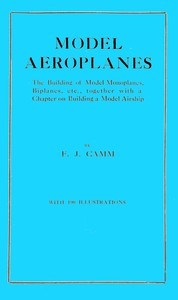

# Model aeroplanes: The building of model monoplanes, biplanes, etc., together with a chapter on building a model airship <kbd>v2.3.0</kbd>

## Authors

 - Camm, F. J. (Frederick James) <small>(1897 - 1959)</small>

## Translators

## Subjects

 - Airplanes

## Readablility

 - **A1:** 67%
 - **A2:** 73%
 - **B1:** 80%
 - **B2:** 88%
 - **C1:** 94%
 - **C2:** 99%

## Words Count

 - **A1:** 377
 - **A2:** 258
 - **B1:** 413
 - **B2:** 529
 - **C1:** 516
 - **C2:** 347

## Source

<kbd>GUTHENBURGE:68100</kbd>
